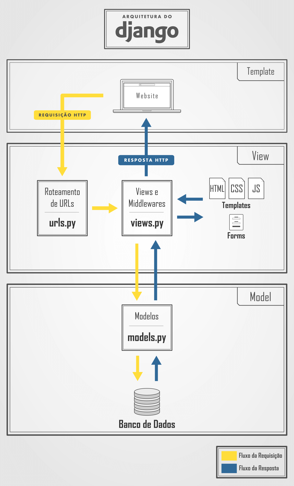

# PSW8.0
Aprendendo sobre DJANGO 

Da permisão para o PowerShell:
Set-ExecutionPolicy -Scope CurrentUser -ExecutionPolicy RemoteSigned

Entrar na venv(env) -> Windowns
env\Scripts\activate

Iniciei o projento no Django com:
pip install django -> Para fazer a instalação 

Para iniciar o projeto. OBS.: sem (<>):\n
django-admin startproject <NomeDoProjeto> .

Rodando a aplicação: 
python manage.py runserver

-> Criando um app:
python manage.py startapp <NomeDoApp>

Leu o models para criação de tabela no banco:
python manage.py makemigrations

Migração(salvar no banco):
python manage.py migrate

Criar user:
python manage.py createsuperuser

Fluxo do Django:

